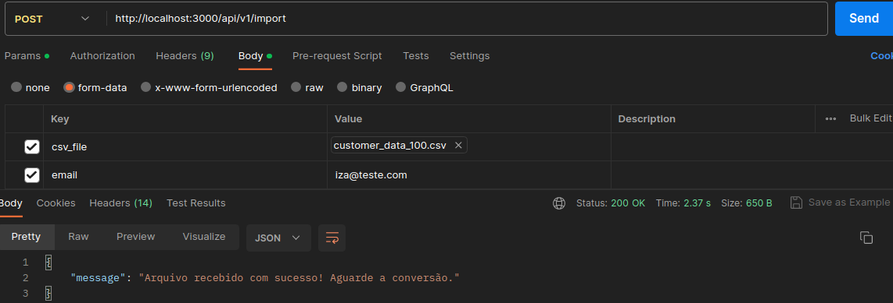

## Projeto csvsplitter
O projeto propõe uma solução de api que receba um arquivo e o devolva quebrado em 50 linhas.<br>
<br>

## Requisitos necessários
* Docker
* Ruby on rails
* Redis
* Sidekiq
<br>

## Gems extras instaladas
* Simplecov
* Factorybot e Faker
* Rspec-sidekiq
* Letter opener
<br>

## Configuração
No seu terminal, clone o projeto.
Renomeie o arquivo `.env.example` para `.env` e substitua os valores ref. ao banco de dados conforme sua preferencia.
Instale os containers e configurações da aplicação:
```sh
docker compose build
```
<br>

## Utilização da api
No seu terminal, após rodar o `docker-compose build`, suba a aplicação:
```sh
docker compose up
```

No Postman, digite a URL http://localhost:3000/api/v1/import <br>
Em **Body**, selecione **form-data**, indique a key `csv_file` e selecione o arquivo csv desejado. (_*A aplicação possui um arquivo teste em spec/fixtures/files/customer_data_100.csv*_)<br>
Indique a key `email` e insira um email qualquer. <br>
Acesse o link http://localhost:3000/letter_opener/ e verifique a chegada do email. <br>
Ao clicar em **Send**, a mensagem seguinte deverá surgir:
```sh
Arquivo recebido com sucesso! Aguarde a conversão
```

<br>

Para encerrar a aplicação:

```sh
docker compose down
```
<br>

## Registro das requisições
Para acessar o banco de dados das requisições feitas:
Suba o terminal do container:
```sh
docker exec -it csvsplitter /bin/bash
```

Já no container, acesse o console:
```sh
rails c
```

Dentro do console é possível visualizar o resumo das requisições efetuadas com sucesso ao digitar o comando abaixo:
```sh
ImportData.all
```

Para sair do console:
```sh
exit
```

<br>

## Utilização na aplicação web (Em construção 🚧)
No seu terminal, após rodar o `docker-compose build`, suba a aplicação:
```sh
docker compose up
```

- Acesse o link http://localhost:3000; <br>
- Nesta página, um formulário aparecerá para preenchimento das infos. Adicione um email válido qualquer, um arquivo csv e clique em "Dividir csv"; <br>
- Em desenvolvimento, acesse o link http://localhost:3000/letter_opener/ e verifique a chegada do email; <br>

Para encerrar a aplicação:
```sh
docker compose down
```
<br>

## Configuração de Email
Este projeto também está pré-ajustado para receber emails em produção. 
Para configurar o envio de emails, substitua as variáveis abaixo do arquivo `.env` pelos valores de preferência:

  ```sh
  MAIL_USER = your_delivery_email@email.com
  MAIL_PASSWORD = your_password
  ```

 (*Para gmail, talvez seja necessário ativar a verificação em duas etapas e usar senha de app conforme descrito [aqui](https://support.google.com/accounts/answer/185833)).


## Testes
Acesse o terminal do container da aplicação:
```sh
docker exec -it csvsplitter /bin/bash
```

Rode o comando de testes:
```sh
rspec
```
<br>
