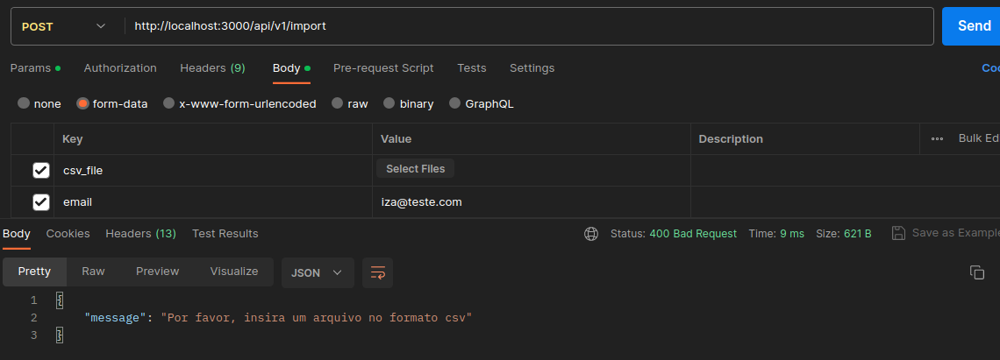
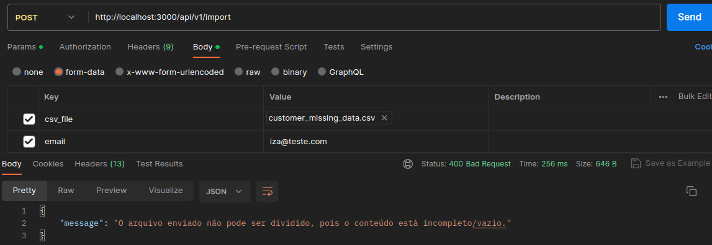
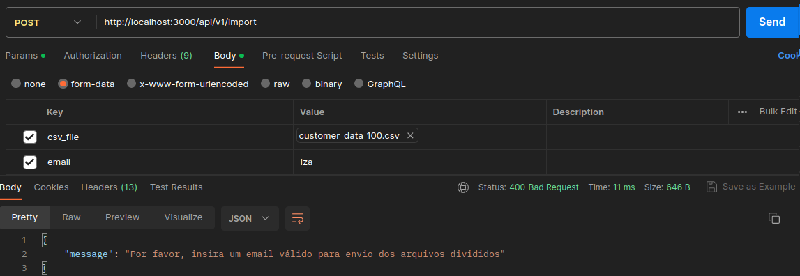

## Projeto csvsplitter
O projeto propõe uma solução de api que receba um arquivo e o devolva quebrado em 50 linhas.<br>
<br><br>

## Requisitos necessários
* Docker
* Ruby on rails
* Mysql
* Redis
* Sidekiq
<br><br>

## Gems extras instaladas
* Simplecov
* Factorybot e Faker
* Rspec-sidekiq
* Letter opener
<br><br>

## Configuração
No seu terminal, clone o projeto.
Instale os containers e configurações da aplicação:
```sh
docker compose build
```
<br><br>

## Utilização da api
No seu terminal, após rodar o `docker-compose build`, suba a aplicação:
```sh
docker compose up
```

No Postman, digite a URL http://localhost:3000/api/v1/import <br>
Em **Body**, selecione **form-data**, indique a key `csv_file` e selecione o arquivo csv desejado. (_*A aplicação possui um arquivo teste em spec/fixtures/files/customer_data_100.csv*_)<br>
Indique a key `email` e insira um email qualquer. <br>
Acesse o link http://localhost:3000/letter_opener/ e verifique a chegada do email. <br>
Ao clicar em **Send**, a mensagem seguinte deverá surgir:
```sh
Arquivo recebido com sucesso! Aguarde a conversão
```

<br><br>

Para encerrar a aplicação:

```sh
docker compose down
```
<br>

## Validação de campos (mensagens de erro)

Caso nenhum arquivo seja selecionado, ou ele não seja csv, o comportamento esperado é a mensagem de erro:
```
Por favor, insira um arquivo no formato .csv
```

<br><br>

Caso o arquivo selecionado não esteja com todos os itens preenchidos *(arquivo para teste disponível na pasta spec/fixtures/files - customer_missing_data.csv)*, o comportamento esperado é a mensagem de erro:
```
O arquivo enviado não pode ser dividido, pois o conteúdo está incompleto.
```

<br><br>

Caso não seja indicado um email, ou o email não esteja em formato válido, o comportamento esperado é a mensagem de erro:
```
Por favor, insira um email válido para envio dos arquivos divididos
```

<br><br>

## Registro das requisições
Para acessar o banco de dados das requisições feitas:
Suba o terminal do container:
```sh
docker exec -it csvsplitter /bin/bash
```

Já no container, acesse o console:
```sh
rails c
```

Dentro do console é possível visualizar o resumo das requisições efetuadas com sucesso ao digitar o comando abaixo:
```sh
ImportData.all
```

Para sair do console:
```sh
exit
```

<br><br>

## Utilização na aplicação web (Em construção 🚧)
No seu terminal, após rodar o `docker-compose build`, suba a aplicação:
```sh
docker compose up
```

- Acesse o link http://localhost:3000; <br>
- Nesta página, um formulário aparecerá para preenchimento das infos. Adicione um email válido qualquer, um arquivo csv e clique em "Dividir csv"; <br>
- Acesse o link http://localhost:3000/letter_opener/ e verifique a chegada do email; <br><br>

Para encerrar a aplicação:
```sh
docker compose down
```
<br><br>

## Testes
Acesse o terminal do container da aplicação:
```sh
docker exec -it csvsplitter /bin/bash
```

Rode o comando de testes:
```sh
rspec
```

<br><br>
